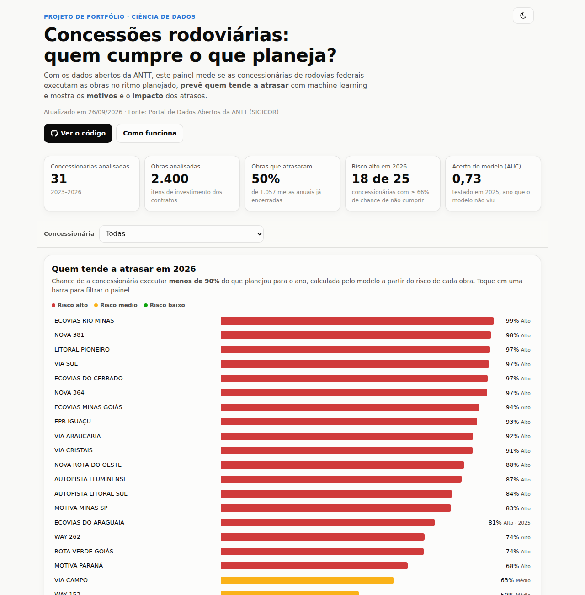
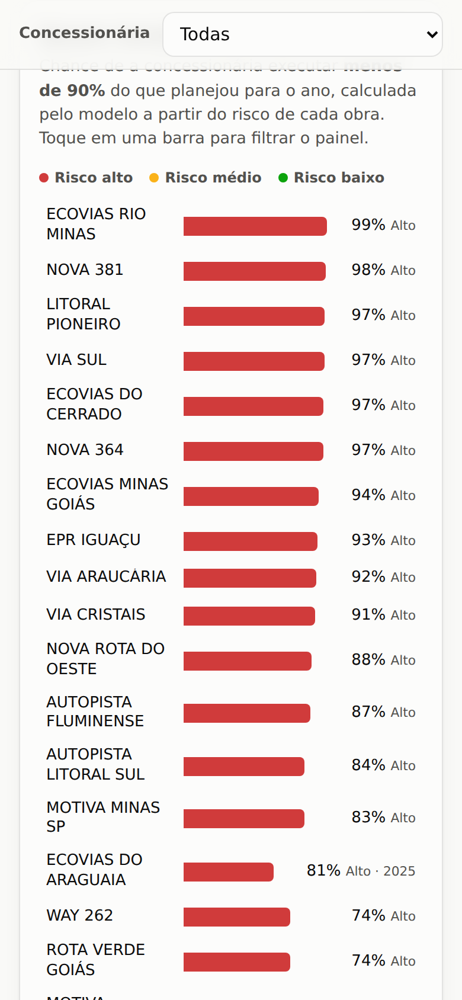
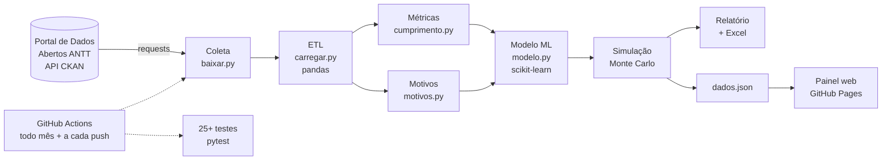

# 🛣️ Concessões rodoviárias: quem cumpre o que planeja?

[](https://github.com/machadomuriloemp-ui/Meu-projeto/actions/workflows/testes.yml)
[](https://github.com/machadomuriloemp-ui/Meu-projeto/actions/workflows/analise.yml)


Projeto de ciência de dados que usa os **dados abertos da ANTT** para analisar se as concessionárias
de rodovias federais executam as obras no ritmo que planejaram. O projeto também **prevê, com machine
learning, quem tende a atrasar** e mostra os motivos e o impacto dos atrasos.

### 👉 [Abrir o painel interativo](https://machadomuriloemp-ui.github.io/Meu-projeto/)

<p align="center">
  
  &nbsp;
  
</p>

---

## O problema

As concessionárias de rodovias federais se comprometem com um plano anual de obras: duplicações,
passarelas, acessos e outras. A ANTT publica mês a mês o **previsto** e o **executado** de cada obra.
O projeto responde a quatro perguntas:

1. **Quem cumpre o planejado?** E isso está melhorando ou piorando?
2. **Quem tende a atrasar este ano?** A resposta vem com uma probabilidade, por concessionária e por obra.
3. **Por que atrasa?** Por licenciamento, desapropriação, projeto, clima…
4. **Qual o impacto?** Em km não entregues, meses de postergação e Fator D (desconto na tarifa).

## Como funciona



| Etapa | O que faz | Ferramentas |
|---|---|---|
| **Coleta** | Descobre e baixa as 4 bases pela API do portal, com novas tentativas e plano B em cache | `requests`, API REST (CKAN) |
| **ETL** | Padroniza nomes de colunas, `"55,7%"`, `"1.234,56"`, datas, acentos e codificações diferentes | `pandas` |
| **Métricas** | Calcula previsto × executado por mês e por ano e a tendência de cada concessionária | `pandas`, `SciPy` (Theil-Sen, Kendall) |
| **Machine learning** | Compara regressão logística × gradient boosting e escolhe o de maior AUC | `scikit-learn` |
| **Simulação** | Faz 5.000 cenários de Monte Carlo para a chance de cada concessionária não cumprir o plano | `NumPy` |
| **Entrega** | Gera o painel web responsivo (claro/escuro), um relatório em Markdown e um Excel | HTML, CSS, JavaScript, SVG |
| **Qualidade** | Roda testes automatizados com dados simulados e CI/CD | `pytest`, GitHub Actions |

## Destaques técnicos

- **Sem "olhar o futuro" (data leakage).** Nos anos passados, o modelo só usa as versões do plano
  que existiam no mesmo ponto do ano em que estamos. Um teste garante isso: sem essa proteção, o
  modelo parecia ótimo no passado, mas falharia no uso real.
- **Validação honesta.** Além da validação cruzada, o modelo é treinado só com anos antigos e testado
  num ano que nunca viu. Resultado atual: **AUC 0,73**, onde 0,5 é o acaso.
- **Testes com gabarito.** Os testes geram bases simuladas no formato exato da ANTT, com respostas
  conhecidas (quem piora, quem melhora, quais motivos), e conferem se a análise as encontra.
- **Robustez.** O código lida com o portal fora do ar, arquivos com codificações diferentes, linhas
  mal formatadas e bases faltando.
- **Estatística robusta.** A tendência usa a reta de Theil-Sen, que não é distorcida por meses com
  percentuais extremos.
- **Painel sem dependências.** Os gráficos foram feitos em SVG com JavaScript puro, sem bibliotecas externas.
- **Automação completa.** Todo mês o GitHub Actions baixa os dados, testa, analisa e atualiza o painel sozinho.

## Estrutura

```
analise/
  baixar.py        coleta pela API do portal (com fallback)
  carregar.py      leitura e padronização (ETL)
  cumprimento.py   previsto × executado, anual e tendência
  motivos.py       fatores de atraso (pendências, observações, revisões do plano)
  obras.py         tabela obra × ano com as variáveis do modelo
  modelo.py        probabilidade de atraso + simulação de Monte Carlo
  impacto.py       km, postergação, inexecução e Fator D
  relatorio.py     relatório em Markdown, gráficos e Excel
  dashboard.py     exporta docs/dados.json para o painel
docs/              painel web (GitHub Pages)
testes/            testes automatizados + gerador de dados simulados
saida/             relatório, Excel e CSVs gerados
.github/workflows  CI (testes) e análise mensal
```

## Bases de dados

Todas vêm do [Portal de Dados Abertos da ANTT](https://dados.antt.gov.br/group/rodovias) (sistema
SIGICOR) e são preenchidas pelas próprias concessionárias:

| Base | Uso |
|---|---|
| [Acompanhamento Anual de Investimentos](https://dados.antt.gov.br/dataset/acompanhamento-anual) | % previsto × % executado de cada obra, mês a mês (obrigatória) |
| [Planejamento Anual de Investimentos](https://dados.antt.gov.br/dataset/planejamento-anual) | Versões do plano, status de projeto, licenciamento e desapropriação, e observações |
| [Cadastros de Investimentos](https://dados.antt.gov.br/dataset/cadastros-investimentos) | Valor contratual e cronograma original |
| [Inexecução Anual](https://dados.antt.gov.br/dataset/inexecucao) | Inexecução oficial e Fator D |

## Como rodar

**Pelo GitHub (sem instalar nada):** vá em **Actions → Rodar análise → Run workflow**. Em cerca de 3
minutos, o painel e o relatório estarão atualizados.

**No computador:**

```bash
pip install -r requirements.txt
python -m pytest testes      # roda os testes
python -m analise            # baixa os dados e gera saida/ e docs/dados.json
python -m http.server -d docs   # abre o painel em http://localhost:8000
```

Se o portal da ANTT estiver fora do ar, coloque os CSVs em `dados/brutos/<base>/` e rode
`python -m analise --offline`.

## Limitações

- Nem todas as concessões estão no SIGICOR, e alguns campos (observações, valor contratual) vêm vazios.
- Os motivos são **associações estatísticas**, não prova de causa.
- O índice mensal dá o mesmo peso a cada obra, porque usa o % de avanço físico.

## Autor

Desenvolvido por [@machadomuriloemp-ui](https://github.com/machadomuriloemp-ui) como projeto de
portfólio do curso de Tecnólogo em Análise e Desenvolvimento de Sistemas.
