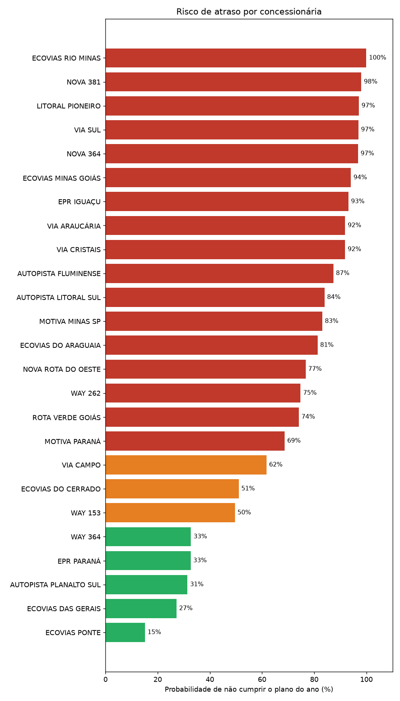
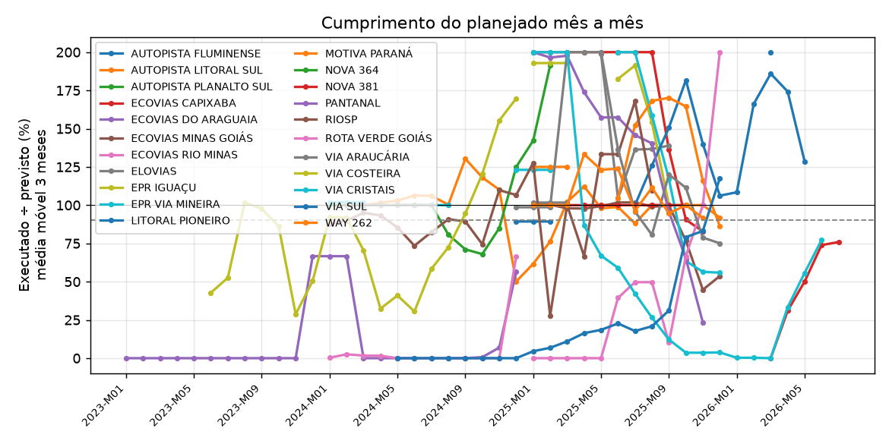
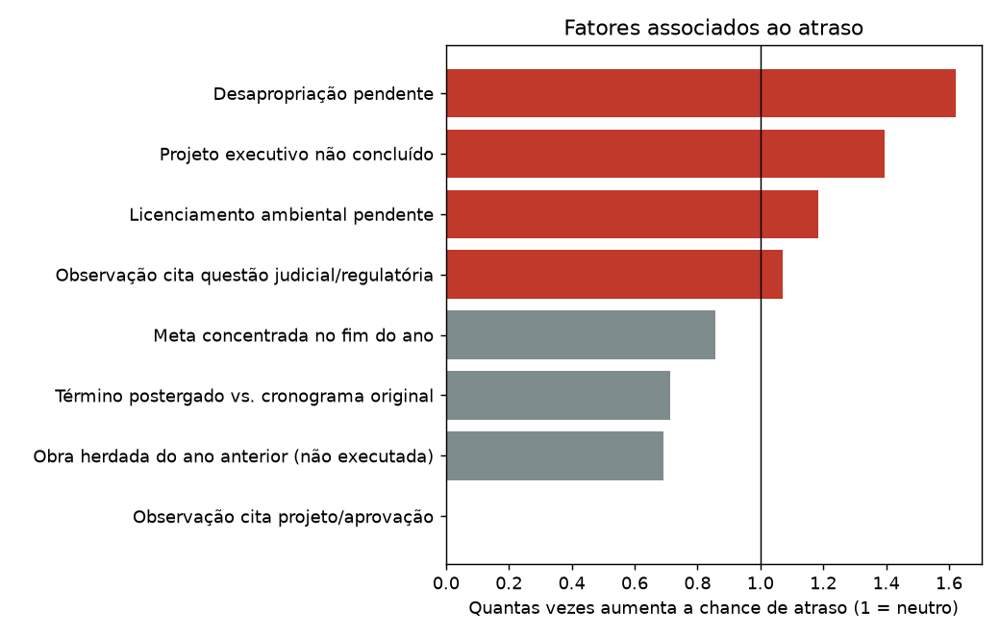

# Cumprimento do planejado — concessões rodoviárias (ANTT)

_Gerado em 26/09/2026 13:15. Fonte: Portal de Dados Abertos da ANTT (SIGICOR). 22 concessionária(s), anos 2023–2026, 1107 obras acompanhadas._

## Resumo

- **Maior risco de atraso:** ECOVIAS RIO MINAS — 99% de chance de não cumprir o plano de 2026 (97 obra(s) em risco).
- **Risco alto:** ECOVIAS RIO MINAS, NOVA 381, LITORAL PIONEIRO, VIA SUL, ECOVIAS DO CERRADO, NOVA 364, ECOVIAS MINAS GOIÁS, EPR IGUAÇU, VIA ARAUCÁRIA, VIA CRISTAIS, NOVA ROTA DO OESTE, AUTOPISTA FLUMINENSE, AUTOPISTA LITORAL SUL, MOTIVA MINAS SP, ECOVIAS DO ARAGUAIA, WAY 262, ROTA VERDE GOIÁS, MOTIVA PARANÁ.
- **Tendência piorando:** ELOVIAS, EPR IGUAÇU, EPR VIA MINEIRA, NOVA 381, PANTANAL, RIOSP.
- **Tendência melhorando:** VIA SUL.
- **Motivos mais associados a atraso:** Desapropriação pendente (1,6×); Projeto executivo não concluído (1,4×); Licenciamento ambiental pendente (1,2×).

## 1. Quem tende a atrasar (ano corrente)

Probabilidade de a concessionária executar menos de 90% do que planejou para o ano, estimada a partir das probabilidades de atraso de cada obra.

| Concessionária | Ano | Risco | Chance de não cumprir | Cumprimento esperado | Obras em risco |
|---|---|---|---|---|---|
| ECOVIAS RIO MINAS | 2026 | Alto | 99% | 50% | 97 |
| NOVA 381 | 2026 | Alto | 98% | 56% | 7 |
| LITORAL PIONEIRO | 2026 | Alto | 97% | 66% | 23 |
| VIA SUL | 2026 | Alto | 97% | 64% | 35 |
| ECOVIAS DO CERRADO | 2026 | Alto | 97% | 56% | 13 |
| NOVA 364 | 2026 | Alto | 97% | 58% | 17 |
| ECOVIAS MINAS GOIÁS | 2026 | Alto | 94% | 49% | 12 |
| EPR IGUAÇU | 2026 | Alto | 93% | 58% | 6 |
| VIA ARAUCÁRIA | 2026 | Alto | 92% | 71% | 20 |
| VIA CRISTAIS | 2026 | Alto | 91% | 55% | 2 |
| NOVA ROTA DO OESTE | 2026 | Alto | 88% | 43% | 2 |
| AUTOPISTA FLUMINENSE | 2026 | Alto | 87% | 59% | 2 |
| AUTOPISTA LITORAL SUL | 2026 | Alto | 84% | 76% | 4 |
| MOTIVA MINAS SP | 2026 | Alto | 83% | 70% | 2 |
| ECOVIAS DO ARAGUAIA | 2025 | Alto | 81% | 72% | 1 |
| WAY 262 | 2026 | Alto | 74% | 76% | 1 |
| ROTA VERDE GOIÁS | 2026 | Alto | 74% | 70% | 0 |
| MOTIVA PARANÁ | 2026 | Alto | 68% | 82% | 5 |
| VIA CAMPO | 2026 | Médio | 63% | 82% | 0 |
| WAY 153 | 2026 | Médio | 50% | 87% | 0 |
| EPR PARANÁ | 2026 | Médio | 33% | 91% | 0 |
| WAY 364 | 2026 | Baixo | 32% | 91% | 0 |
| AUTOPISTA PLANALTO SUL | 2026 | Baixo | 31% | 82% | 1 |
| ECOVIAS DAS GERAIS | 2026 | Baixo | 27% | 92% | 0 |
| ECOVIAS PONTE | 2025 | Baixo | 6% | 95% | 0 |

### Os dados estão completos? (investimento × execução física)

Quando a concessionária declara investimento no ano mas não informa execução física das obras, o mais provável é falta de preenchimento. Esses anos ficam fora do cálculo de atraso e do modelo. A base de investimentos é anual e por concessionária.

- **ECOVIAS CAPIXABA · 2025** — A ECOVIAS CAPIXABA não aparece com esse nome na base de investimentos da ANTT; não foi possível comparar.
- **ECOVIAS DO ARAGUAIA · 2025** — Em 2025, a ECOVIAS DO ARAGUAIA declarou R$ 353,5 mi de investimento, mas não enviou o acompanhamento de execução de nenhuma das 42 obras planejadas. Isso indica falta de preenchimento, não necessariamente obra parada. Esse ano não entra no cálculo de atraso.
- **ECOVIAS DO CERRADO · 2024** — Em 2024, a ECOVIAS DO CERRADO declarou R$ 362,6 mi de investimento, mas não enviou o acompanhamento de execução de nenhuma das 118 obras planejadas. Isso indica falta de preenchimento, não necessariamente obra parada. Esse ano não entra no cálculo de atraso.
- **ECOVIAS DO CERRADO · 2025** — Em 2025, a ECOVIAS DO CERRADO declarou R$ 240,5 mi de investimento, mas não enviou o acompanhamento de execução de nenhuma das 132 obras planejadas. Isso indica falta de preenchimento, não necessariamente obra parada. Esse ano não entra no cálculo de atraso.
- **ECOVIAS PONTE · 2024** — Em 2024, a ECOVIAS PONTE declarou R$ 64,3 mi de investimento, mas não enviou o acompanhamento de execução de nenhuma das 1 obras planejadas. Isso indica falta de preenchimento, não necessariamente obra parada. Esse ano não entra no cálculo de atraso.
- **ECOVIAS PONTE · 2025** — Em 2025, a ECOVIAS PONTE declarou R$ 49,7 mi de investimento, mas não enviou o acompanhamento de execução de nenhuma das 1 obras planejadas. Isso indica falta de preenchimento, não necessariamente obra parada. Esse ano não entra no cálculo de atraso.
- **ECOVIAS RIO MINAS · 2025** — Em 2025, a ECOVIAS RIO MINAS declarou R$ 1,49 bi de investimento, mas não enviou o acompanhamento de execução de nenhuma das 537 obras planejadas. Isso indica falta de preenchimento, não necessariamente obra parada. Esse ano não entra no cálculo de atraso.
- **MOTIVA PARANÁ · 2025** — A MOTIVA PARANÁ não aparece com esse nome na base de investimentos da ANTT; não foi possível comparar.
- **NOVA ROTA DO OESTE · 2025** — A NOVA ROTA DO OESTE não aparece com esse nome na base de investimentos da ANTT; não foi possível comparar.
- **PANTANAL · 2025** — A PANTANAL não aparece com esse nome na base de investimentos da ANTT; não foi possível comparar.
- **VIA COSTEIRA · 2025** — Em 2025, a VIA COSTEIRA declarou R$ 396,4 mi de investimento, mas não enviou o acompanhamento de execução de nenhuma das 358 obras planejadas. Isso indica falta de preenchimento, não necessariamente obra parada. Esse ano não entra no cálculo de atraso.

_Sem correspondência na base de investimentos: AUTOPISTA FERNÃO DIAS, AUTOPISTA REGIS BITTENCOURT, CCR PONTE, CONCEBRA, CONCEPA, CONCER, CRO, CRT, ECOVIAS 101, ECOVIAS SUL, MGO, MSVIA, NOVADUTRA, PR VIAS, RODOVIA DO AÇO, TRANSBRASILIANA, VIA 040, VIA BAHIA, VIABRASIL._

### O modelo acerta? Teste às cegas em 2025

Treinado só com anos anteriores a 2025 e sem ver o resultado, o modelo previu 370 obras. A tabela compara a faixa de risco prevista com o que realmente aconteceu. Ele detectou 60 dos 134 atrasos.

| Previsão do modelo | Obras | Realmente atrasaram | Modelo esperava |
|---|---|---|---|
| Risco alto | 87 | 57% | 79% |
| Risco médio | 81 | 58% | 46% |
| Risco baixo | 202 | 18% | 19% |

### O que deve ficar para 2027

| Concessionária | Obras que devem ir para 2027 | Obras no plano |
|---|---|---|
| ECOVIAS RIO MINAS | 83 | 164 |
| VIA ARAUCÁRIA | 31 | 75 |
| VIA SUL | 30 | 56 |
| NOVA 364 | 20 | 40 |
| LITORAL PIONEIRO | 18 | 29 |
| ECOVIAS DO ARAGUAIA | 12 | 42 |
| ECOVIAS DO CERRADO | 11 | 19 |
| ECOVIAS MINAS GOIÁS | 9 | 13 |
| NOVA 381 | 6 | 12 |
| MOTIVA MINAS SP | 6 | 16 |
| VIA CAMPO | 5 | 25 |
| EPR IGUAÇU | 5 | 9 |

## 2. Histórico e tendência mês a mês

Índice = soma do % executado ÷ soma do % previsto das obras no mês. Tendência = inclinação da reta ao longo dos meses (pontos percentuais por ano).

| Concessionária | Cumprimento médio | Últimos 6 meses | Meses cumpridos | Tendência | pp/ano |
|---|---|---|---|---|---|
| AUTOPISTA FLUMINENSE | 150% | 150% | 100% | Dados insuficientes | – |
| AUTOPISTA LITORAL SUL | 95% | 96% | 75% | Estável | -2,1 |
| AUTOPISTA PLANALTO SUL | 88% | 75% | 77% | Estável | -8,9 |
| ECOVIAS CAPIXABA | 118% | 87% | 75% | Estável | 0,0 |
| ECOVIAS DO ARAGUAIA | 13% | 28% | 8% | Estável | 0,0 |
| ECOVIAS MINAS GOIÁS | 88% | 77% | 83% | Estável | -1,5 |
| ECOVIAS RIO MINAS | 13% | 25% | 8% | Estável | 0,0 |
| ELOVIAS | 64% | 53% | 44% | Piorando | ≤ -100 |
| EPR IGUAÇU | 69% | 42% | 38% | Piorando | ≤ -100 |
| EPR VIA MINEIRA | 94% | 78% | 50% | Piorando | -25,7 |
| LITORAL PIONEIRO | 119% | 127% | 75% | Estável | 0,0 |
| MOTIVA PARANÁ | 108% | 106% | 75% | Estável | -99,0 |
| NOVA 364 | 0% | 0% | 0% | Dados insuficientes | – |
| NOVA 381 | 82% | 65% | 58% | Piorando | -13,4 |
| PANTANAL | 97% | 49% | 67% | Piorando | ≤ -100 |
| RIOSP | 71% | 22% | 39% | Piorando | -45,6 |
| ROTA VERDE GOIÁS | 30% | 50% | 20% | Dados insuficientes | – |
| VIA ARAUCÁRIA | 103% | 97% | 71% | Estável | -1,6 |
| VIA COSTEIRA | 75% | 115% | 42% | Estável | 42,1 |
| VIA CRISTAIS | 40% | 39% | 13% | Estável | -32,6 |
| VIA SUL | 26% | 71% | 10% | Melhorando | 29,0 |
| WAY 262 | 104% | 102% | 70% | Dados insuficientes | – |

### Cumprimento por ano encerrado

| Concessionária | Ano | Obras | Executado ÷ previsto | Obras que cumpriram | vs. plano original |
|---|---|---|---|---|---|
| AUTOPISTA LITORAL SUL | 2024 | 33 | 437% | 94% | 573% |
| AUTOPISTA LITORAL SUL | 2025 | 3 | 59% | 33% | 72% |
| AUTOPISTA PLANALTO SUL | 2024 | 2 | 65% | 50% | 65% |
| AUTOPISTA PLANALTO SUL | 2025 | 1 | 0% | 0% | 0% |
| ECOVIAS CAPIXABA | 2025 | 25 | 73% | 44% | 580% |
| ECOVIAS DO ARAGUAIA | 2023 | 26 | 100% | 100% | 144% |
| ECOVIAS DO ARAGUAIA | 2024 | 22 | 10% | 5% | 10% |
| ECOVIAS MINAS GOIÁS | 2025 | 12 | 141% | 83% | 141% |
| ECOVIAS RIO MINAS | 2024 | 305 | 21% | 9% | 25% |
| ELOVIAS | 2025 | 11 | 64% | 36% | 64% |
| EPR IGUAÇU | 2025 | 25 | 88% | 88% | 93% |
| EPR VIA MINEIRA | 2024 | 16 | 105% | 100% | 107% |
| EPR VIA MINEIRA | 2025 | 7 | 77% | 57% | 77% |
| LITORAL PIONEIRO | 2024 | 28 | 88% | 71% | 84% |
| LITORAL PIONEIRO | 2025 | 14 | 83% | 79% | 97% |
| MOTIVA PARANÁ | 2025 | 26 | 93% | 73% | 87% |
| NOVA 364 | 2025 | 28 | 100% | 100% | 104% |
| NOVA 381 | 2025 | 18 | 112% | 100% | 106% |
| PANTANAL | 2025 | 39 | 40% | 13% | 40% |
| RIOSP | 2024 | 194 | 82% | 62% | 202% |
| RIOSP | 2025 | 1 | 2% | 0% | 2% |
| ROTA VERDE GOIÁS | 2025 | 25 | 100% | 100% | 102% |
| VIA ARAUCÁRIA | 2024 | 19 | 90% | 84% | 90% |
| VIA ARAUCÁRIA | 2025 | 13 | 80% | 46% | 80% |
| VIA COSTEIRA | 2023 | 12 | 105% | 100% | 105% |
| VIA COSTEIRA | 2024 | 29 | 89% | 76% | 98% |
| VIA CRISTAIS | 2025 | 28 | 95% | 93% | 96% |
| VIA SUL | 2024 | 1 | 100% | 100% | 100% |
| VIA SUL | 2025 | 72 | 63% | 35% | 64% |
| WAY 262 | 2025 | 22 | 95% | 95% | 97% |

## 3. Motivos de atraso

**Lift** = quantas vezes a presença do fator aumenta a chance de a obra atrasar, comparado à média. Baseado nas obras de anos encerrados.

| Fator | Obras | Atraso com fator | Sem fator | Lift |
|---|---|---|---|---|
| Desapropriação pendente | 47 | 81% | 48% | 1,6× |
| Projeto executivo não concluído | 574 | 70% | 27% | 1,4× |
| Licenciamento ambiental pendente | 66 | 59% | 49% | 1,2× |
| Observação cita questão judicial/regulatória | 15 | 53% | 50% | 1,1× |
| Meta concentrada no fim do ano | 365 | 43% | 54% | 0,9× |
| Término postergado vs. cronograma original | 121 | 36% | 52% | 0,7× |
| Obra herdada do ano anterior (não executada) | 122 | 34% | 52% | 0,7× |
| Observação cita projeto/aprovação | 22 | 0% | 51% | 0,0× |
| Observação cita contratação/suprimentos | 1 | 0% | 50% | 0,0× |

### Por concessionária

| Concessionária | Obras atrasadas | Principais fatores |
|---|---|---|
| AUTOPISTA LITORAL SUL | 4 | Obra herdada do ano anterior (não executada) (3); Meta concentrada no fim do ano (1) |
| AUTOPISTA PLANALTO SUL | 2 | Meta concentrada no fim do ano (1) |
| ECOVIAS CAPIXABA | 14 | Projeto executivo não concluído (11); Meta concentrada no fim do ano (11); Desapropriação pendente (3) |
| ECOVIAS DO ARAGUAIA | 21 | Licenciamento ambiental pendente (21); Desapropriação pendente (21); Projeto executivo não concluído (6) |
| ECOVIAS MINAS GOIÁS | 2 | Projeto executivo não concluído (2); Término postergado vs. cronograma original (2); Obra herdada do ano anterior (não executada) (2) |
| ECOVIAS RIO MINAS | 278 | Projeto executivo não concluído (253); Meta concentrada no fim do ano (23); Término postergado vs. cronograma original (8) |
| ELOVIAS | 7 | Projeto executivo não concluído (4); Meta concentrada no fim do ano (4); Observação cita questão judicial/regulatória (1) |
| EPR IGUAÇU | 3 | Meta concentrada no fim do ano (1) |
| EPR VIA MINEIRA | 3 | Projeto executivo não concluído (3); Desapropriação pendente (3); Meta concentrada no fim do ano (3) |
| LITORAL PIONEIRO | 11 | Meta concentrada no fim do ano (11); Projeto executivo não concluído (7) |
| MOTIVA PARANÁ | 7 | Meta concentrada no fim do ano (7); Projeto executivo não concluído (6); Licenciamento ambiental pendente (6) |
| PANTANAL | 34 | Meta concentrada no fim do ano (32); Projeto executivo não concluído (31); Desapropriação pendente (1) |
| RIOSP | 74 | Projeto executivo não concluído (60); Meta concentrada no fim do ano (45); Licenciamento ambiental pendente (6) |
| VIA ARAUCÁRIA | 10 | Projeto executivo não concluído (7); Meta concentrada no fim do ano (3) |
| VIA COSTEIRA | 7 | Obra herdada do ano anterior (não executada) (6); Projeto executivo não concluído (5); Término postergado vs. cronograma original (4) |
| VIA CRISTAIS | 2 | Meta concentrada no fim do ano (2) |
| VIA SUL | 47 | Término postergado vs. cronograma original (28); Obra herdada do ano anterior (não executada) (28); Meta concentrada no fim do ano (8) |
| WAY 262 | 1 | Sem motivo registrado nas bases |

### Tipos de obra que mais atrasam

| Tipo de obra | Obras | Taxa de atraso |
|---|---|---|
| Demolição | 6 | 100% |
| Veículos da Polícia Rodoviária Estadual | 3 | 100% |
| Melhoria em Acesso (local a definir) | 145 | 94% |
| Rotatória em Nível | 8 | 88% |
| Alargamento de Obra-de-Arte Especial | 26 | 85% |
| Unidade Operacional da Polícia Rodoviária Federal | 12 | 83% |
| Passagem Inferior | 9 | 78% |
| Faixa Adicional | 37 | 76% |
| Via Marginal | 69 | 74% |
| Retorno em Nível | 27 | 70% |

### Peso de cada fator no modelo

| Fator | Efeito | Peso |
|---|---|---|
| Observação cita projeto/aprovação | quanto maior, MENOS risco | -0,91 |
| Nº de meses com meta | quanto maior, MAIS risco | 0,68 |
| Fração da meta nos meses 10–12 | quanto maior, MAIS risco | 0,65 |
| Executado ÷ previsto no ano até agora | quanto maior, MENOS risco | -0,54 |
| Prazo previsto (meses) | quanto maior, MENOS risco | -0,48 |
| Projeto executivo pendente | quanto maior, MAIS risco | 0,47 |
| Observação cita questão judicial/regulatória | quanto maior, MAIS risco | 0,46 |
| % da obra previsto para o ano | quanto maior, MENOS risco | -0,32 |
| % executado antes do ano | quanto maior, MAIS risco | 0,29 |
| Desapropriação pendente | quanto maior, MAIS risco | 0,24 |

## 4. Impacto

Déficit = % previsto − % executado. Km e R$ = déficit aplicado à extensão e ao valor contratual (quando informados). Fator D = desconto na tarifa aplicado pela ANTT por inexecução.

| Concessionária | Obras atrasadas | Km não entregues | Valor não executado | Postergação média (meses) | Inexecução oficial | Fator D |
|---|---|---|---|---|---|---|
| ECOVIAS RIO MINAS | 278 | 490,7 | – | 0,4 | – | – |
| RIOSP | 74 | 1.854,1 | – | 0,2 | – | – |
| VIA SUL | 47 | 91,6 | – | 4,9 | – | – |
| PANTANAL | 34 | 13,2 | – | 0,0 | – | – |
| ECOVIAS DO ARAGUAIA | 21 | 25,1 | – | 0,0 | – | – |
| ECOVIAS CAPIXABA | 14 | 2,8 | – | 0,0 | – | – |
| LITORAL PIONEIRO | 11 | 0,0 | – | 0,0 | 13% | 0,20% |
| VIA ARAUCÁRIA | 10 | 0,0 | – | 0,0 | – | – |
| MOTIVA PARANÁ | 7 | 0,0 | – | 0,0 | – | – |
| VIA COSTEIRA | 7 | 0,3 | – | 3,5 | – | – |
| ELOVIAS | 7 | 0,0 | – | 0,0 | – | – |
| AUTOPISTA LITORAL SUL | 4 | 4,8 | R$ 12,8 mi | 6,7 | – | – |
| EPR VIA MINEIRA | 3 | 0,0 | – | 0,0 | – | – |
| EPR IGUAÇU | 3 | 0,0 | – | 0,0 | – | – |
| AUTOPISTA PLANALTO SUL | 2 | 4,3 | R$ 2,4 mi | 3,0 | – | – |
| ECOVIAS MINAS GOIÁS | 2 | 0,0 | – | 20,0 | – | – |
| VIA CRISTAIS | 2 | 0,0 | – | 0,0 | 9% | 0,00% |
| WAY 262 | 1 | 0,0 | – | 0,0 | 5% | 0,00% |
| NOVA 364 | 0 | 0,0 | – | 0,0 | – | – |
| NOVA 381 | 0 | 0,0 | – | 0,0 | – | – |
| ROTA VERDE GOIÁS | 0 | 0,0 | – | 0,0 | – | – |

**Impacto esperado no ano corrente** (probabilidade × o que falta executar):

| Concessionária | Valor em risco | Km em risco | Faixa provável de cumprimento |
|---|---|---|---|
| ECOVIAS RIO MINAS | – | 461,1 | 26%–75% |
| NOVA 381 | – | 0,0 | 33%–80% |
| LITORAL PIONEIRO | – | 81,7 | 50%–82% |
| VIA SUL | – | 97,7 | 45%–82% |
| ECOVIAS DO CERRADO | – | 89,7 | 31%–81% |
| NOVA 364 | – | 1.453,7 | 33%–82% |
| ECOVIAS MINAS GOIÁS | – | 0,6 | 10%–86% |
| EPR IGUAÇU | – | 0,0 | 25%–88% |
| VIA ARAUCÁRIA | – | 38,2 | 52%–89% |
| VIA CRISTAIS | – | 0,0 | 25%–86% |
| NOVA ROTA DO OESTE | R$ 39,5 mi | 1,6 | 10%–95% |
| AUTOPISTA FLUMINENSE | – | 0,9 | 28%–100% |
| AUTOPISTA LITORAL SUL | R$ 11,1 mi | 3,8 | 55%–92% |
| MOTIVA MINAS SP | – | 0,3 | 43%–93% |
| ECOVIAS DO ARAGUAIA | – | 21,3 | 47%–93% |
| WAY 262 | – | 0,0 | 49%–98% |
| ROTA VERDE GOIÁS | – | 101,2 | 40%–100% |
| MOTIVA PARANÁ | – | 0,0 | 66%–97% |
| VIA CAMPO | – | 0,0 | 60%–99% |
| WAY 153 | – | 0,0 | 70%–100% |
| EPR PARANÁ | – | 0,0 | 76%–100% |
| WAY 364 | – | 0,0 | 76%–100% |
| AUTOPISTA PLANALTO SUL | R$ 1,9 mi | 0,3 | 46%–100% |
| ECOVIAS DAS GERAIS | – | 0,0 | 80%–100% |
| ECOVIAS PONTE | R$ 226.224 | 0,1 | 100%–100% |

## 5. Obras com maior probabilidade de atraso

| Concessionária | Obra | Chance de atraso | Motivos prováveis |
|---|---|---|---|
| NOVA 381 | C.Estabilização de Taludes da BR-381/MG (BR-381/MG, km 294,8) | 96% | Desapropriação pendente; Projeto executivo não concluído; Meta anual pequena (obra em fase inicial/final) |
| ECOVIAS DO CERRADO | Alargamento e Adequação de OAE, Ponte sobre o Córreg... (BR-364/GO, km 125,9) — 2 itens | 94% | Meta concentrada no fim do ano; Obra já avançada em anos anteriores; Meta anual pequena (obra em fase inicial/final) |
| ECOVIAS DO CERRADO | Reforço e Alargamento de OAE, Ponte Ribeirão dos Pat... (BR-365/MG, km 847,8) — 2 itens | 94% | Obra já avançada em anos anteriores; Meta anual pequena (obra em fase inicial/final); Meta concentrada no fim do ano |
| NOVA 381 | Contrução de UOPs da PRF (BR-381/MG, km 217,5) | 92% | Baixa execução no ano até agora; Tipo de obra que costuma atrasar; Prazo previsto curto |
| ECOVIAS RIO MINAS | Q. Pontos de ônibus - SEGMENTO 7' - RJ (BR-116/RJ, km 182,6) — 10 itens | 92% | Meta espalhada por muitos meses; Projeto executivo não concluído; Tipo de obra que costuma atrasar |
| ECOVIAS DO CERRADO | Alargamento e Adequação de OAE, Ponte sobre o Rio Do... (BR-364/GO, km 113,2) — 2 itens | 92% | Meta anual pequena (obra em fase inicial/final); Meta concentrada no fim do ano; Prazo previsto curto |
| ECOVIAS RIO MINAS | L. Acessos - SEGMENTO 7' - RJ (BR-116/RJ, km 182,6) — 17 itens | 92% | Tipo de obra que costuma atrasar; Meta espalhada por muitos meses; Projeto executivo não concluído |
| ECOVIAS RIO MINAS | B. Implantação de Faixa Adicional (BR-116/RJ, km 182,6) — 2 itens | 92% | Meta espalhada por muitos meses; Tipo de obra que costuma atrasar; Projeto executivo não concluído |
| VIA SUL | Iluminação em travessias urbanas - BR-386/RS - ID 10... (BR-386/RS, km 180,2) | 90% | Obra já avançada em anos anteriores; Projeto executivo não concluído; Meta anual pequena (obra em fase inicial/final) |
| AUTOPISTA PLANALTO SUL | Execução de Terceiras Faixas (Terceiras Faixas 28 km... (BR-116/SC, km 302,6) | 88% | Meta anual pequena (obra em fase inicial/final); Tipo de obra que costuma atrasar; Projeto executivo não concluído |
| VIA SUL | Iluminação em travessias urbanas - BR-101/RS ID 1 a 5. (BR-101/RS, km 0,0) | 88% | Obra já avançada em anos anteriores; Tipo de obra que costuma atrasar; Prazo previsto curto |
| LITORAL PIONEIRO | E. Trombeta (BR-153/PR, km 23,4) | 87% | Desapropriação pendente; Projeto executivo não concluído; Prazo previsto curto |
| LITORAL PIONEIRO | H. Trevo (BR-153/PR, km 1,0) | 86% | Meta espalhada por muitos meses; Projeto executivo não concluído; Meta concentrada no fim do ano |
| ECOVIAS MINAS GOIÁS | Melhoria em Acesso - ID-4 - km 282,00 - Catalão (BR-050/GO, km 282,0) | 86% | Obra já avançada em anos anteriores; Meta anual pequena (obra em fase inicial/final); Projeto executivo não concluído |
| LITORAL PIONEIRO | F. Diamante (BR-153/PR, km 43,9) | 86% | Desapropriação pendente; Meta espalhada por muitos meses; Projeto executivo não concluído |

_Lista completa no Excel (aba `previsao_obras`)._

## 6. Confiabilidade do modelo

- Obras-ano usadas no treino: 1057 (taxa histórica de atraso: 50%)
- Modelo escolhido: Gradient boosting (comparação AUC: {'Regressão logística': 0.862, 'Gradient boosting': 0.919})
- AUC na validação cruzada: 0,92 (0,5 = acaso; 0,7 = razoável; 0,8+ = bom)
- AUC treinando só com anos anteriores e testando em 2025: 0,73

## Como ler e limitações

- Uma obra **atrasou** quando executou menos de 90% do % previsto para o ano.
- Meses ainda não informados pela concessionária não contam como descumprimento.
- As bases são preenchidas pelas próprias concessionárias no SIGICOR; nem todas as concessões estão no sistema e campos como observações e valor contratual podem estar vazios.
- Os motivos são **associações** estatísticas e registros das bases, não prova de causa.
- O índice mensal trata cada obra com o mesmo peso (% de avanço físico).
